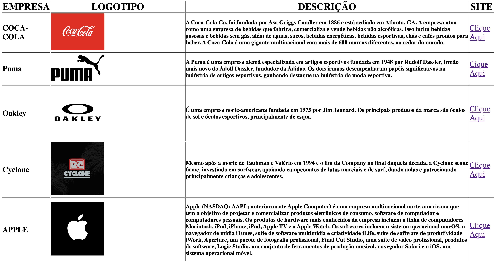

# Landing Page - Tabela

---
## Sobre
Site do tipo landing Page para divulgar Marcas em forma de tabela.
O intuito é colocar em prática o conhecimento adquirido sobre as linguagens de marcação, HTML, CSS e Markdown,realizadas no curso técnico de desenvolvimento de sistemas do [SENAI Jandira](https://sp.senai.br/unidade/jandira/)

---

## Tecnicas utilizadas
- HTML
- CSS
- Markdown
- Git

---

# Autor
- [Hiago Rodrigues](https://www.linkedin.com/in/hiago-rodrigues-ortolan-8a3507327/)
